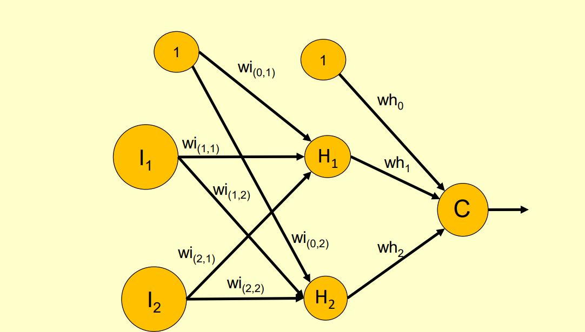
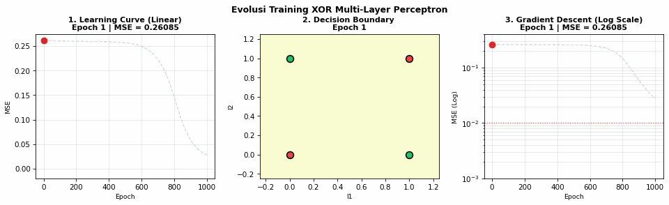

# Multi-Layer Perceptron (MLP) — Penyelesaian Masalah Logika XOR

Repository ini berisi implementasi mandiri **Multi-Layer Perceptron (MLP)** dengan algoritma *Backpropagation Gradient Descent* untuk menyelesaikan permasalahan klasifikasi non-linear gerbang logika XOR (*Exclusive-OR*).

---

## 📌 Latar Belakang Masalah

Gerbang logika XOR menghasilkan keluaran bernilai `1` jika kedua inputnya berbeda, dan bernilai `0` jika kedua inputnya sama:

| $x_1$ | $x_2$ | Target ($y$) |
|:-----:|:-----:|:------------:|
|   0   |   0   |      0       |
|   0   |   1   |      1       |
|   1   |   0   |      1       |
|   1   |   1   |      0       |

Secara matematis, data XOR bersifat ***non-linearly separable*** (tidak dapat dipisahkan hanya dengan satu garis lurus/hiperbidang linier). Kegagalan Single Layer Perceptron (SLP) dalam memecahkan masalah ini pernah diungkapkan oleh Marvin Minsky dan Seymour Papert (1969). Solusinya adalah menggunakan **Multi-Layer Perceptron (MLP)** dengan satu *hidden layer* yang mampu melengkungkan ruang representasi fitur sehingga batas keputusan (*decision boundary*) non-linear dapat terbentuk.

---

## 🧠 Arsitektur Jaringan



Model dirancang dengan topologi:
* **Input Layer**: 2 neuron ($I_1, I_2$) ditambah 1 unit bias.
* **Hidden Layer**: 2 neuron ($H_1, H_2$) dengan fungsi aktivasi **Sigmoid** $\sigma(z) = \frac{1}{1 + e^{-z}}$.
* **Output Layer**: 1 neuron ($C$) dengan fungsi aktivasi **Sigmoid** ditambah unit bias.
* **Learning Rate ($\mu$)**: `0.5`
* **Metode Optimasi**: *Stochastic / Batch Gradient Descent Backpropagation*
* **Fungsi Loss**: Mean Squared Error (MSE) $\mathcal{L} = \frac{1}{N} \sum (y - \hat{y})^2$

---

## 🎬 Animasi Evolusi Pembelajaran (57 Frame)

Evolusi dinamis proses pembelajaran model selama ribuan iterasi terekam secara visual dalam animasi berikut:



Animasi di atas menampilkan 3 komponen utama secara simultan:
1. **Learning Curve (Skala Linear)**: Penurunan nilai loss MSE menuju 0.
2. **Decision Boundary (2D Contour Plot)**: Dinamika pembentukan permukaan probabilitas non-linear yang secara presisi mengisolasi titik target `0` dan `1`.
3. **Gradient Descent Convergence (Skala Logaritmik)**: Konvergensi eksponensial nilai MSE melintasi batas presisi $\le 0.01$.

---

## 📊 Evaluasi Multi-Epoch (1, 10, 100, 1000)

Pada notebook [`XOR_Multi_Perceptron.ipynb`](XOR_Multi_Perceptron.ipynb), evaluasi komparatif disajikan pada milestone epoch:

* **Epoch 1**: Bobot masih acak, model belum mengenali pola, MSE tinggi ($\approx 0.25$), batas keputusan datar.
* **Epoch 10**: Gradien mulai menggeser bobot, permukaan probabilitas mulai melengkung namun belum memisahkan kelas dengan sempurna.
* **Epoch 100**: Model berhasil menemukan orientasi hiperbidang di hidden layer, pembagian area XOR mulai terbentuk jelas.
* **Epoch 1000**: Konvergensi sempurna tercapai, MSE drop hingga $< 0.005$, seluruh titik input XOR terklasifikasi dengan akurasi 100%.

---

## 📁 Struktur Berkas

```text
.
├── XOR_Multi_Perceptron.ipynb   # Notebook Jupyter utama (kode pelatihan, visualisasi grid & generator animasi)
├── xor_learning_evolution.gif   # Berkas GIF animasi komparatif 57-frame halus
├── image.png                    # Diagram arsitektur MLP
├── .gitignore                   # Konfigurasi pengabaian file temporary/cache
└── README.md                    # Dokumentasi proyek
```

---

## 🚀 Cara Menjalankan

1. **Clone repository ini**:
   ```bash
   git clone https://github.com/YonoBengkel/XOR-Multi-Layer-Perceptron.git
   cd XOR-Multi-Layer-Perceptron
   ```

2. **Kebutuhan Pustaka**:
   Pastikan telah terpasang:
   ```bash
   pip install numpy matplotlib pillow jupyter
   ```

3. **Buka Notebook**:
   ```bash
   jupyter notebook XOR_Multi_Perceptron.ipynb
   ```
   Atau jalankan langsung melalui Visual Studio Code.
